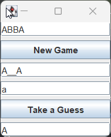

# Angabe
- [Link zur Angabe](https://www.eduvidual.at/mod/assign/view.php?id=6290140)
- Deadline: 2024-10-12
```
       1. Lernziele
    • Hangman Algorithmus erstellen
    • Klassenstruktur planen
    • Umsetzung in JAVA mit Swing Klasse (GUI)

    2. Aufgabenstellung
    • Teil 1
        ◦ Welche Klassen werden benötigt?
        ◦ Wie erfolgt die Ausgabe des Status?
            ▪ Es reicht die Anzahl der Versuche zu zählen von 0 bis 9 Fehler 
            ▪ Danach „Game Over“
        ◦ Eingabe von Buchstaben in Textfeld
        ◦ Ausgabe des Lösungswortes mit _ als versteckte Buchstaben
        ◦ History der Buchstaben ausgeben
        ◦ Wenn gelöst: Neu Start ermöglichen
        ◦ Liste der Wörter: statisch im Array
        ◦ Grafische Ausgabe mit 9 Bildern – je Fehlversuch wird ein Bild in ein Panel geladen (einfach die Fehlversuche mitzählen und begrenzen – siehe Eduvidual)
    • Teil 2:
        ◦ Anzahl der Versuche sollte im Menü einstellbar sein. (JMenu)
        ◦ Wörter dynamisch aus Datei lesen (mittels File & Scanner Klasse)
        ◦ History der Buchstaben ausgeben sollte als es als Option im Menü geben (JCheckBoxMenuItem)

```
## Zusammengefasst
## Ziele
- Hangman-Spiel-GUI erstellen
- Hangman-Spiel-Logik schreiben
## ToDo
- Spiellogik schreiben

# Protokoll
## Klasse für Spiellogik erstellen
### Konstruktor
- Ein neues Spiel braucht das gesuchte Wort "safeword"
- Der aktuelle Fortschritt soll auch erstellt werden. 
  - Dabei wird jeder Buchstabe des safewords durch '_' ersetzt.
```java
public class HangmanGame {
    String safeword;
    ArrayList<Character> usedCharacters;
    String currentSolution;
    char currentChar;
    int wrongGuesses = 0;
    int maxGuesses = 6;

    public HangmanGame(String strSafeword) {
        safeword = strSafeword.toUpperCase();
        int i = 0;
        while (i < safeword.length()) {
            currentSolution += "_";
        }
        currentSolution = currentSolution.trim();
    }
    //...
}
```
### Methode: Hauptspielzug: einen Buchstaben raten
- Der Buchstabe soll zur Liste der verwendeten Buchstaben hinzugefügt werden
- Ein falscher Buchstabe soll als solcher erfasst werden
- Ein richtiger Buchstabe soll an allen Plätzen in der Lösung eingefügt werden
- Überprüfung ob man das Spiel gewonnen hat
```java
public void takeAGuess (Character chCurrenChar){
    currentChar = Character.toUpperCase(chCurrenChar);
    int i = safeword.indexOf(currentChar);
    if(i==(-1)){
        wrongGuesses++;
        //ToDo: methode für Fehler
    }
    while ((i<safeword.length()) && (i!=(-1))){
        currentSolution = currentSolution.substring(0,i)
                +currentChar
                +currentSolution.substring( i+1);
    }
    if (currentSolution.equals(safeword)){
        //ToDo: methode für Sieg
    }
}
```
## Erstentwurf GUI für grundlegende Funktionstests
```java
import javax.swing.*;
import java.awt.event.ActionEvent;
import java.awt.event.ActionListener;

public class GameGUI {
    private JTextField txtSafeword;
    private JPanel panel1;
    private JTextField txtCurrentSolution;
    private JTextField txtUsedCharacters;
    private JTextField txtInput;
    private JButton btnTakeAGuess;
    private JButton btnNewGame;
    private HangmanGame myGame;

    public GameGUI() {
        btnNewGame.addActionListener(new ActionListener() {
            @Override
            public void actionPerformed(ActionEvent event) {
                String safeword = txtSafeword.getText();
                myGame = new HangmanGame(safeword);
                txtCurrentSolution.setText(myGame.currentSolution);
            }
        });
        btnTakeAGuess.addActionListener(new ActionListener() {
            @Override
            public void actionPerformed(ActionEvent event) {
                String userInput = txtInput.getText();
                char currentChar = userInput.charAt(0);

                myGame.takeAGuess(currentChar);
                txtCurrentSolution.setText(myGame.currentSolution);

            }
        });

    }

    public static void main(String[] args) {
        JFrame frame = new JFrame("Hangman");
        frame.setContentPane(new GameGUI().panel1);
        frame.setDefaultCloseOperation(JFrame.EXIT_ON_CLOSE);
        frame.pack();
        frame.setVisible(true);
    }
}
```
- das Programm friert nach klick auf den New Game - Button. 
  - Das lag daran, dass ich eine endlosschleife im Handgman-Konstruktur prodziert hatte.
  - Eine sehr änliche Endlosschleife war auch in der takeAGuess-Methode
  - ich vergaß den Wert von i innerhalb der Schleife erhöhen
Gefixter Code:
```java
    public HangmanGame(String strSafeword){
        safeword = strSafeword.toUpperCase();
        currentSolution = "";
        int i = 0;
        while (i<safeword.length()){
            currentSolution += "_";
            //Fix: The line below
            i++;
        }
        currentSolution = currentSolution.trim();
    }

    public void takeAGuess (Character chCurrenChar){
        currentChar = Character.toUpperCase(chCurrenChar);
        int i = safeword.indexOf(currentChar);
        if(i==(-1)){
            wrongGuesses++;
            //ToDo: methode für Fehler
        }
        while ((i<safeword.length()) && (i!=(-1))){
            currentSolution = currentSolution.substring(0,i)
                    +currentChar
                    +currentSolution.substring( i+1);
            //Fix: the line below
            i = safeword.indexOf(currentChar,i+1);
        }
        if (currentSolution.equals(safeword)){
            //ToDo: methode für Sieg
        }
    }
```

### Methode für guessWrong
- wrongGuesses++ wird aus der methode takeAGuess() rausgenommen 
- und passenderweise in die neue Methode eingefügt
```java
public void guessWrong(char chCurrentChar){
  wrongGuesses++;
  if(wrongGuesses >= maxGuesses){
    usedCharacters = "You lost to: \""+ safeword + "\"";
  }
}
```

### Methode für Sieg
```java
 public void takeAGuess (Character chCurrenChar) {
    //...
    //Sieg
    if (currentSolution.equals(safeword)) {
        usedCharacters = "Congratulations, you win!";
    }
}
```
- Statt einem Array von Chars wird für die verwendeten Buchstaben ein String verwendet
- ein paar weitere kleine Bugfixes später sieht das Ganze so aus

### Usability verbessern
- Bei Klick auf OK: aktuelle eingabe löschen und fokus auf eingabe
```java
btnTakeAGuess.addActionListener(new ActionListener() {
    //...
    txtInput.setText("");
    txtInput.grabFocus();
    //...
```
## Hangman Bilder hinzufügen
- Ich schaffe es nicht, das erste Bild hinzuzufügen.
- Anscheinend funktioniert das nicht in der Main methode.